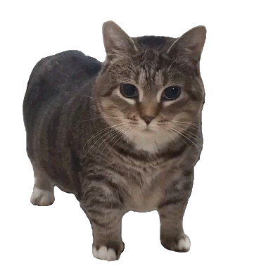
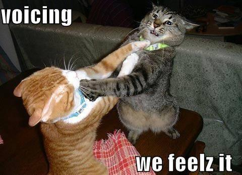
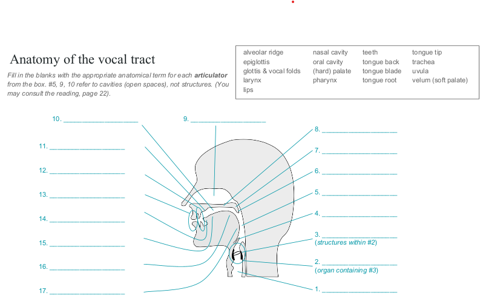
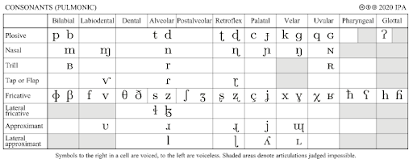
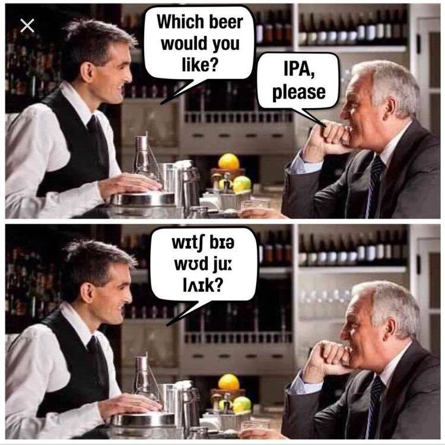
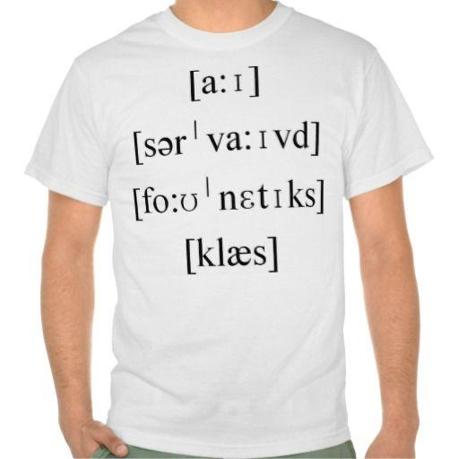

class: center, middle

# Review 

---

# Review

Last week was <span style="color: red;">vowels</span>, now we're moving on to the other main type of segment in phonetics... <span style="color: blue;">consonants!</span>

--

.pull-left[
<span style="color: red;">Vowels</span>

- *unobstructed airflow*

- *voiced*

]

--

.pull-right[
<span style="color: blue;">Consonants</span>

- *partial or complete obstruction*

- *may or may not be voiced*
]


```{r, out.height="25%", out.width="25%", echo=FALSE}

```

---

# Review

<span style="color: blue;">Consonant features:</span>

- <span style="color: green;">Voicing:</span> vibration of the vocal cords

- <span style="color: green;">Place:</span> where is the obstruction of airflow in the vocal tract?

- <span style="color: green;">Manner</span> what type of obstruction of airflow occurs?

```{r, out.height="50%", out.width="50%", echo=FALSE}

```


---

# Review anatomy

```{r, out.height="150%", out.width="150%", echo=FALSE}

```


---

class: center, middle

# Review (consonant features)

---

# Review (consonant features)

```{r, out.height="100%", out.width="100%", echo=FALSE}

```

--

The <span style="color: green;">*columns*</span> are for <span style="color: blue;">*place*</span> 

The <span style="color: green;">*rows*</span> are for <span style="color: blue;">*manner*</span>

When there's two in a cell, the <span style="color: green;">right</span> is <span style="color: blue;">*voiced*</span>

---

class: center, middle

# Review (place of articulation)


---

# Review (place of articulation)

***Where is the obstruction in the vocal tract?***

--

- <span style="color: blue;">Labials:</span> lips

  - <span style="color: green;">Bilabials:</span> both lips
  
  - <span style="color: green;">Labiodentals:</span> lower lips and upper teeth

--

- <span style="color: blue;">Coronals:</span> between the tongue tip/blade and the front part of the mouth

  - <span style="color: green;">Dentals:</span> tongue and teeth 
  
  - <span style="color: green;">Alveolars:</span> tongue and alveolar ridge
  
  - <span style="color: green;">Postalveolars:</span> tongue and the space right behind alveolar ridge

---

# Review (place of articulation)

***Where is the obstruction in the vocal tract?***

--

- <span style="color: blue;">Retroflexes:</span> the tongue tip is arched backward

--

- <span style="color: blue;">Palatals:</span> tongue body raised against the hard palate 

--

- <span style="color: blue;">Velars:</span> back of tongue against the soft palate (=velum)

--

- <span style="color: blue;">Gutturals:</span> pronounced in the very back of the mouth 
  
  - <span style="color: green;">Uvulars:</span> back of tongue against the uvula
  
  - <span style="color: green;">Pharyngeals:</span> root of tongue obstructing the pharynx
  
  - <span style="color: green;">Glottals:</span> vocal folds obstructing the glottis
  
---

class: center, middle

# Review (manner of articulation)


---

# Review (manner of articulation)

***What type of obstruction is it?*** 

--

Is it <span style="color: blue;">complete</span> blockage of airflow?

--

- <span style="color: green;">*stops/plosives*</span>
  
  - stops can be **aspirated** (pronounced with a tiny [h] sound after the obstruction is released)

--

- <span style="color: green;">*trills, taps, flaps*</span>

  - obstruction doesn't last long enough to cause a release of pressure at the end
  
---

# Review (manner of articulation)

***What type of obstruction is it?***

--

Is it <span style="color: blue;">partial</span> blockage of airflow?

--

- <span style="color: green;">*fricatives*</span>
  
- <span style="color: green;">*approximants*</span>

  - have less obstruction than fricatives

--
  
- <span style="color: green;">*laterals*</span>

  - obstruction in the center, but air flows past the tongue on the side(s)
  

---

# Review (manner of articulation)

***What type of obstruction is it?***

--

Is the airflow blocked in <span style="color: blue;">*one part*</span> of the vocal tract but allowed to flow through a different part?

--

- <span style="color: green;">*affricates*</span>

  - a combination between stops and fricatives

- <span style="color: green;">*nasals*</span>

  - complete obstruction through the *oral cavity* but air is redirected to flow through the *nasal cavity*

---

# Review (manner of articulation)

Manner of articulation can be grouped into **sound classes**

--

.pull-left[
- <span style="color: blue;">liquids:</span> 

  - rhotics + laterals 
  
]

.pull-right[
- <span style="color: blue;">rhotics:</span> 

  - *r*-like sounds
]

--

- <span style="color: blue;">obstruents:</span> 

  - consonants with *more* obstruction 

  - <span style="color: green;">*stops, fricatives, affricates*</span>

--

- <span style="color: blue;">sonorants:</span> 

  - consonants with *less* obstruction

  - <span style="color: green;">*nasals, liquids, approximants*</span>
  

---

class: center, middle

# Practice!!!


```{r, out.height="50%", out.width="50%", echo=FALSE}

```

---

# Practice (description)

**Give a full description of EACH consonant in the following words, and give the corresponding IPA symbol.** (Ex. [p] *is a voiceless bilabial stop*)

1. move

2. hide

3. cloth

4. stove

5. gosh

6. bank

7. thrift

8. hard

9. fork

---

# Practice (description)

**Give the full description of each IPA symbol, and give an example of an English word with that phoneme in it.**

1. [f]

2. [l]

3. [ŋ]

4. [k]

5. [ʔ]

6. [w]

7. [ð]

8. [t͡ʃ]

9. [θ]


---

class: center, middle

# Practice

## Transcribing and reading IPA!

---

# Practice: transcribe

**Transcribe English into IPA.**

1. water

2. orange

3. extremely

4. portrays

5. successful

6. noises

7. poor

8. technology

9. philosopher

10. handkerchiefs


---

# Practice: Reading IPA

**What English words do these IPA transcriptions correspond to?**

1. [ˈelbəw]

2. [vajəˈlɪn]

3. [ˈajlənd]

4. [ˈpiːpl]

5. [ˈdʒʌmpər]

6. [ˈdendʒərəs]

7. [ˈiːzi]

8. [jʌŋ]

9. [ɡreps]

10. [rajs]

---

# Practice: Reading IPA

**What English words do these IPA transcriptions correspond to?**

1. [ˈbɑːθruːm]

2. [ˈʌŋkl]

3. [ˈrʌbər]

4. [rajt]

5. [ˈejrpɔrt]

6. [ɔːˈɡʌst]

7. [jɪr]

8. [ɡəˈrɪlə]

9. [ˈbʌtərflaj]

10. [məˈskiːtəw]

---

# Yay!


```{r, out.height="75%", out.width="75%", echo=FALSE}

```


---

# Coming up: Phonology!

### Reading 

- read the **phonetics chapter** if you haven't already!

- read the **phonology chapter** from the Grady textbook, for **Nov 19**.


### Homework 

- HW7 should be published soon...


### Scheduling

- Thanksgiving week (the week of Nov 23), **recitation will be on Wednesday, but it will probably be asynchronous work**

